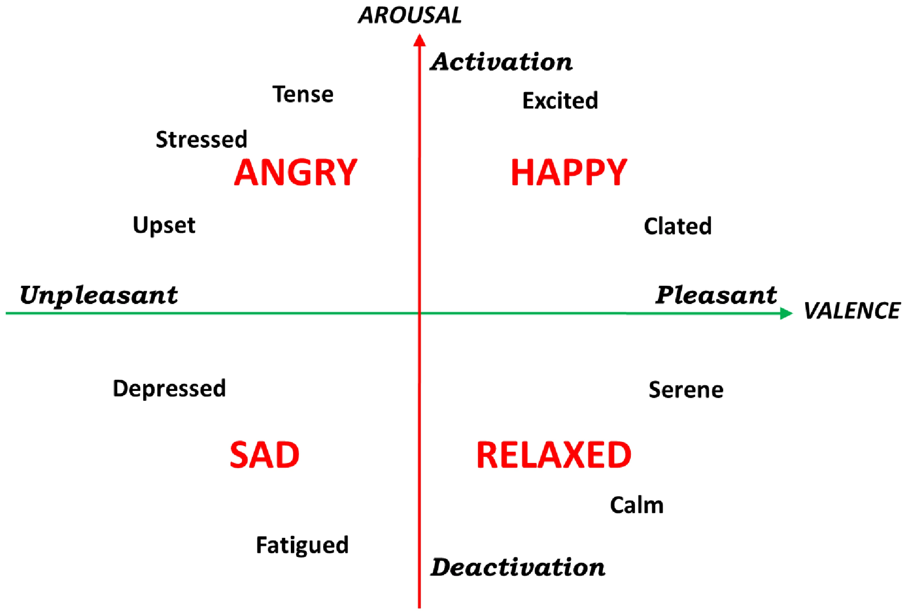
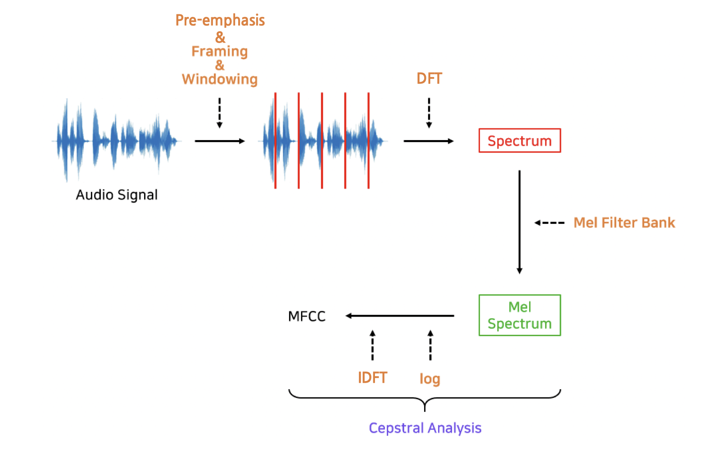
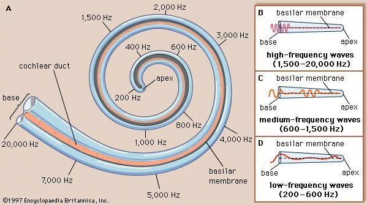
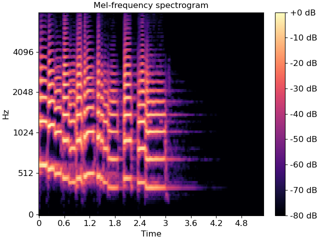
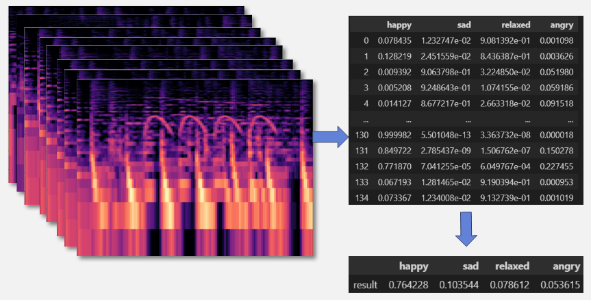
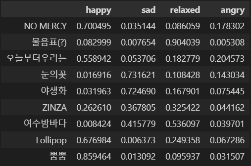

# 희열(HUIYEOL)
<p align="center"></p>
<br>

## 프로젝트 소개
> 희열은 음악의 가사와 음원의 특징을 학습하여 감정을 추론하여<br>
>
> 사용자의 플레이리스트의 감정과 비슷한 음악을 추천해주는 웹 서비스입니다.<br>
>
> Project: 2022.11.07 ~ 2022.12.12
<br>

<p align="center"></p>

## 기술스택
### Front-End
   

### Back-End
  

### Server


## 팀
<p align="center"></p>

> # 1. 자연어 처리

# 1. 음원가사 감정 분류 기준

## 1. Robert Plutchik 감정모델(Electra)

</br>
<p align="center"></p>

- 감정 분류
  - joy
  - trust
  - fear
  - surprise
  - sadness
  - disgust
  - anger
  - anticipation

### A. Base

- 감정 분류 그대로 사용
- 정확도 약 40%

### B. + Neutrality

- 기존 감정 분류에 중립 감정 추가
- 정확도 약 44%

### C. - Anticipation

- 기존 감정 분류에 중립 감정을 추가하고 ‘기대’ 감정 제거
- 정확도 약 47%

## 2. Paul Ekman 감정모델(Electra)

</br>
<p align="center"></p>

- 감정 분류
  - angry
  - fear
  - happy
  - sad
  - surprsie
  - contempt

### A. AI hub 데이터 사용

- 일상 대화 데이터 약 8만개 사용
- 기존 분류에 dislike, 중립 감정 추가
- 정확도 약 50%

### B. - contempt

- contempt 감정 → dislike로 분류
- 정확도 약 54%

### C. + complex

- 복합 감정 태그 추가
- 정확도 약 50%

## 3. 긍정, 중립, 부정 3분류

- AI hub 데이터를 사용하여 긍정, 부정, 중립 감정으로 라벨링
- 정확도 70%

### A. 부정 감정 세부 분류

- 긍정 + 중립 데이터를 제외한 데이터로 모델 학습 및 예측
- angry, dislike(dislike + contempt), fear, sad, surprise 5가지로 세부 분류

# 2. 음원가사 전처리

### A. 어절 단위 120개 슬라이싱

- 학습할 수 있는 최대 토큰 개수
- Electra Tokenizer가 자동으로 토큰화하기 때문에 토큰 개수가 120개 보다 많아져서 문장이 잘리는 문제 확인

### B. 어절 단위 60개 슬라이싱

- 문장이 잘리는 문제를 해결하기 위해 반토막 냄
- 문장이 길어 한 문장에 여러 감정이 포함되는 문제가 생김
- 슬라이싱 후 남은 짧은 문장들이 발생

### C. 어절 단위 20개 슬라이싱

- 한 문장에 여러 감정이 포함되는 문제 해결
- 슬라이싱 후 남은 짧은 문장을 그 전 문장에 합침

# 3. 프로세스

### 사용 라이브러리

```python
numpy==1.21.6
pandas==1.3.5
tqdm==4.64.1
tensorflow==2.10.0
transformers==4.24.0
```

### 필요 라이브러리 import 및 변수 설정

```python
import os
import numpy as np
import pandas as pd
import pickle
from tqdm import tqdm

import tensorflow as tf
from transformers import TFElectraModel
```

<p align="center"></p>
<br/>

### 결과 예시

|     | SONG_ID | SONG_TITLE       | LYRICS | score                        | senti | final_score                                    | final_senti | total                                                   |
| --- | ------- | ---------------- | ------ | ---------------------------- | ----- | ---------------------------------------------- | ----------- | ------------------------------------------------------- |
| 0   | 9270    | 매직 카펫 라이드 | -      | [0.121995 0.293892 0.584113] | pos   | [0.148379 0.245044 0.067424 0.509761 0.029392] | happy       | [0.731059 0.039905 0.065902 0.018133 0.137096 0.007905] |
| 1   | 19807   | 벌써 일년        | -      | [0.319238 0.256552 0.424209] | pos   | [0.167217 0.091865 0.019813 0.712458 0.008647] | happy       | [0.552486 0.074832 0.041111 0.008867 0.318835 0.00387 ] |
| 2   | 32616   | 3!4!             | -      | [0.069013 0.425081 0.505906] | pos   | [0.054421 0.044274 0.028501 0.866249 0.006555] | happy       | [0.718446 0.015322 0.012465 0.008025 0.243895 0.001846] |
| 3   | 33133   | DOC와 춤을       | -      | [0.38072  0.380664 0.238616] | neg   | [0.138274 0.582804 0.094649 0.175393 0.00888 ] | dislike     | [0.304481 0.096172 0.405351 0.06583  0.121989 0.006176] |

> # 2. 이미지 처리

# 1.음원 파형 감정 분류
## 1. Thayer's valence and arousal model
<center>

</center>

- 음악의 각성도와 감정가에 의한 4분류
    - HAPPY
    - RELAXED
    - ANGRY
    - SAD

# 2. 요구사항
## 1. 라이브러리
>numpy==1.21.3<br>
pandas==1.3.5<br>
tensorflow==2.3.0<br>
librosa==0.9.2<br>

## 2. GPU
> cuda 10.1 <br>
GTX 1650 Ti 4GB


# 3. 전처리 및 추론 방법
## 1. Mel-Spectrogram 을 이용한 파형 분석

- Mel-Spectrogarm
    > 실제 주파수 정보를 인간의 청각 구조를 반영하여 수학적으로 변환하기 위한 방법


    > 가청주파수 영역으로 변환


    > Mel-Spectrogram



## 2. 전체곡에 대한 분석 방법론
- 전체길이를 2.7초 단위의 Mel-Spectrogram 조각으로 분리하여 각 분석 결과를 사용한 보팅(Voting) 기법 사용

- 모든 조각에 대한 판정결과를 평균으로 환산하여 곡의 감정 추론


# 4. 학습성능
- 2.7초 영역에 대한 정확도
    - 76.2% 

- 결과 예시

