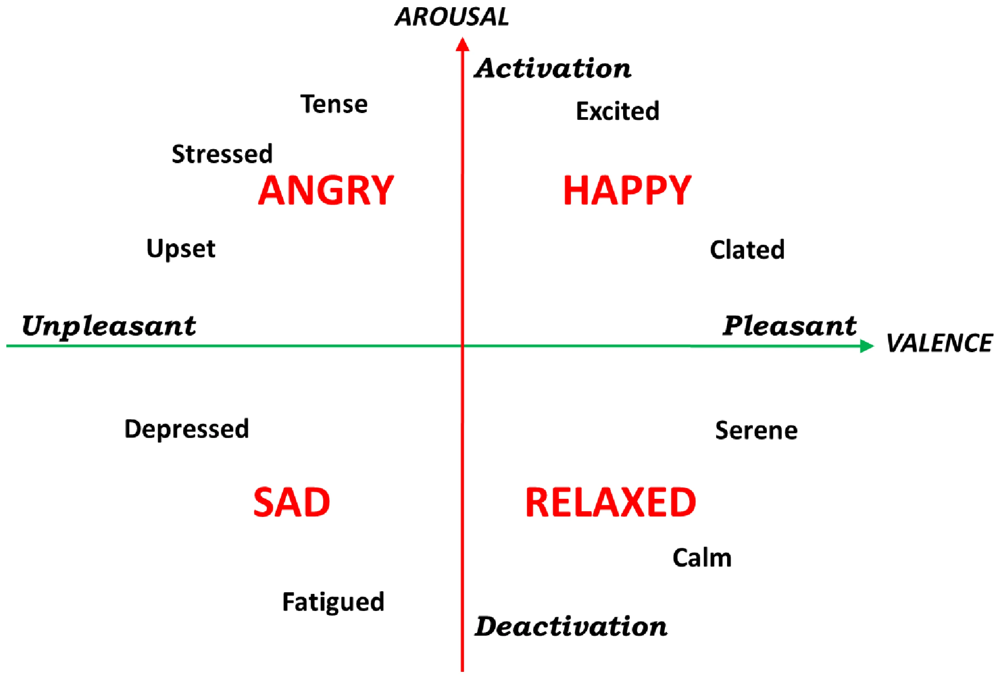
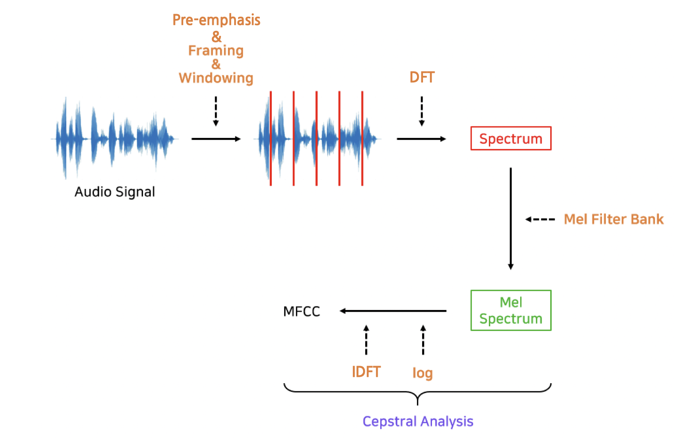
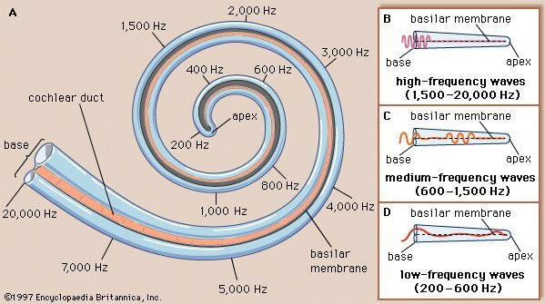
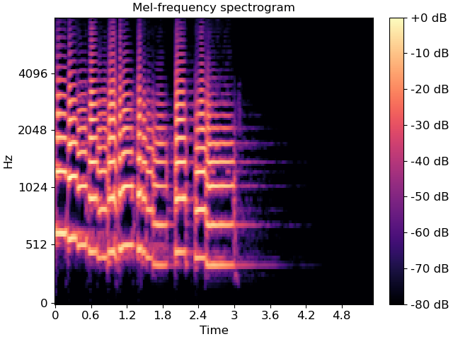
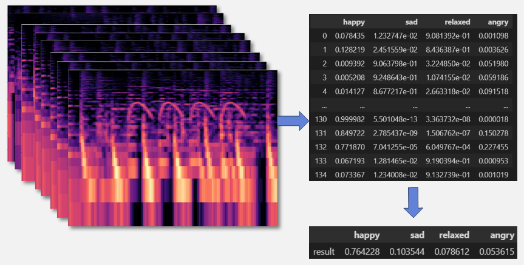
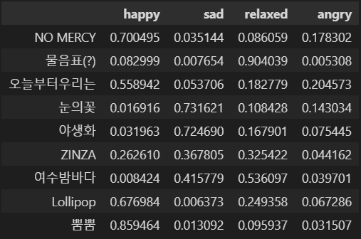

# 1.음원 파형 감정 분류
## 1. Thayer's valence and arousal model

- 음악의 각성도와 감정가에 의한 4분류
    - HAPPY
    - RELAXED
    - ANGRY
    - SAD

# 2. 요구사항
## 1. 라이브러리
>numpy==1.21.3 
pandas==1.3.5 
tensorflow==2.3.0 
librosa==0.9.2 

## 2. GPU
> cuda 10.1  
GTX 1650 Ti 4GB

# 3. 전처리 및 추론 방법
## 1. Mel-Spectrogram 을 이용한 파형 분석

- Mel-Spectrogarm
    > 실제 주파수 정보를 인간의 청각 구조를 반영하여 수학적으로 변환하기 위한 방법

    > 가청주파수 영역으로 변환

    > Mel-Spectrogram

## 2. 전체곡에 대한 분석 방법론
- 전체길이를 2.7초 단위의 Mel-Spectrogram 조각으로 분리하여 각 분석 결과를 사용한 보팅(Voting) 기법 사용

- 모든 조각에 대한 판정결과를 평균으로 환산하여 곡의 감정 추론

# 4. 학습성능
- 2.7초 영역에 대한 정확도
    - 76.2% 

- 결과 예시

